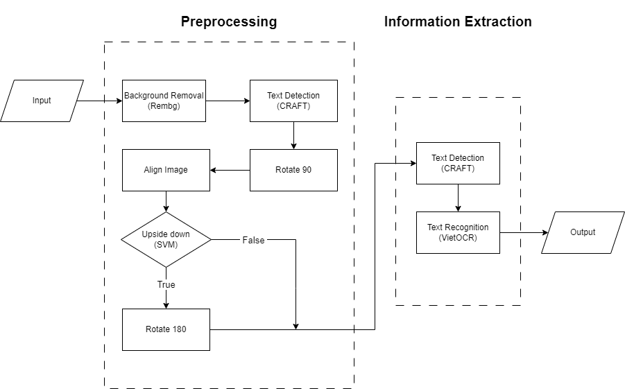
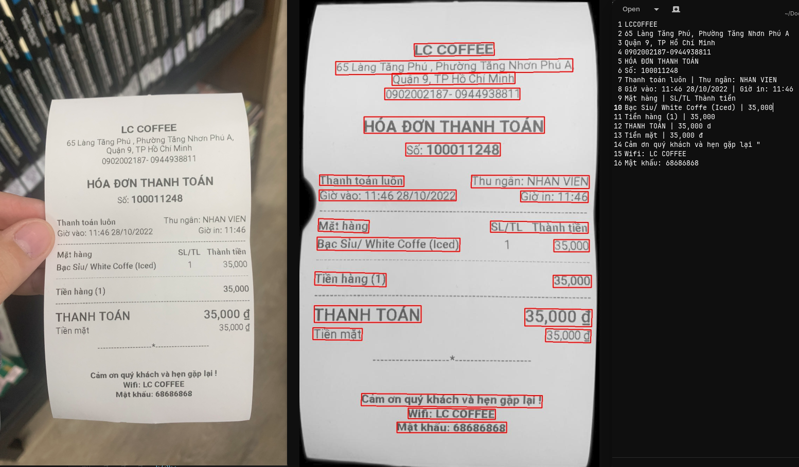
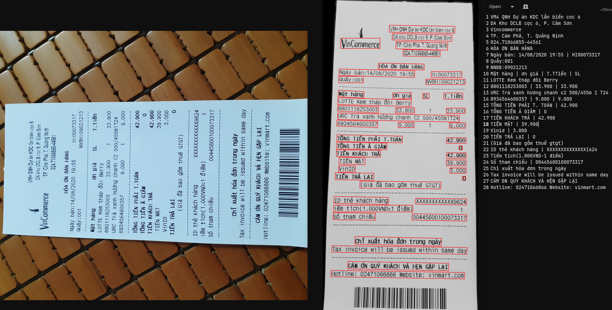

# Receipt Information Extraction (RIE)
Project completed on 21/03/2023

This project is inspired by MC-OCR, more information about this competition can access [here](https://www.rivf2021-mc-ocr.vietnlp.com/).
The dataset is contain more than 1500 receipts from the competition and our collected, can be download here: [Google Drive](https://drive.google.com/file/d/1W_wIY9LatOfpxi7oO3B9h-6JxdgC-jWG/view?usp=share_link)


---
### Table of Contents
- [Receipt Information Extraction (RIE)](#receipt-information-extraction-rie)
    - [Table of Contents](#table-of-contents)
  - [Introduction](#introduction)
  - [Install](#install)
    - [Version](#version)
    - [Requirements](#requirements)
  - [Usage](#usage)
    - [One-time run](#one-time-run)
    - [Each step run](#each-step-run)
      - [1. Remove background](#1-remove-background)
      - [2. Rotate](#2-rotate)
      - [3. Extract information](#3-extract-information)
  - [Results](#results)
  - [Citations](#citations)
  - [License](#license)
  - [References](#references)


## Introduction
Receipt Information Extraction (RIE) is a task that involves extracting structured data from unstructured receipts. The goal is to identify and extract key information such as date, time, total amount, tax amount, items purchased, etc. from receipts in various formats and languages. This task can be useful for applications such as expense management, accounting, fraud detection and analytics.




## Install
Clone with git or download the project here: [RIE](https://github.com/HT0710/Receipt-Information-Extraction/archive/refs/heads/main.zip)
```bash
git clone https://github.com/HT0710/Receipt-Information-Extraction
cd Receipt-Information-Extraction
```

### Version
- **`Python 3.8`**

Using conda:
```bash
conda create -n rie python=3.8
conda activate rie
```

### Requirements
- rembg = 2.0.30
- torch = 1.11
- torchvision = 0.12
- opencv-python = 4.7.0.72
- scikit-learn = 1.2.1
- scikit-image = 0.19.3
- scipy= = .9.3
- imutils = 0.5.4
- PyYAML = 6.0
- einops = 0.6.0
- gdown = 4.6.4
```bash
pip install -r requirements.txt
```

## Usage
### One-time run
Modify the configurations in `config.yaml` then run:
```bash
python run.py
```
With CLI:
```bash
python run.py -h
```
- -i: Image path or Folder path
- -o: Output folder path
- -g: Which gpu to run | 0 for cpu | -1 for all (Default: -1)
- -mp: Maximum of cpu can use | -1 for 80% of your cpu (Default: -1)

Note: Max 100% your cpu may run out of memory or worst crash your system 

**Example:**
```bash
python run.py -i data/test/test_1.jpg -o output -g 0 -mp 10
```
More configurations can access in `config.yaml`

### Each step run
#### 1. Remove background
- Remove the image background
- Input and output folder can be modify in `background_remove.py`
- Note: only run with folder input

Execute:
```bash
python background_remove.py
```

#### 2. Rotate
- Rotate horizontal, invert and align straight
- Input and output folder can be modify in `rotate.py`
- Note: only run with folder input

Execute:
```bash
python rotate.py
```

#### 3. Extract information
- Extract the receipt information
- Input and output can be modify in `extract_info.py`
- Note: only run with single image input, if you want extract a folder please use `run.py`

Execute:
```bash
python extract_info.py
```

## Results



## Citations
You can find the paper here: [RIE](https://github.com/HT0710/Receipt-Information-Extraction/tree/main/example/RIE.pdf)

## License
This project is licensed under the MIT License. See LICENSE for more details.

## References
- [Rembg](https://github.com/danielgatis/rembg) - [danielgatis](https://github.com/danielgatis)
- [CRAFT-pytorch](https://github.com/clovaai/CRAFT-pytorch) - [clovaai](https://github.com/clovaai)
- [VietOCR](https://github.com/pbcquoc/vietocr) - [pbcquoc](https://github.com/pbcquoc)
- [PICK-pytorch](https://github.com/wenwenyu/PICK-pytorch) - [wenwenyu](https://github.com/wenwenyu)